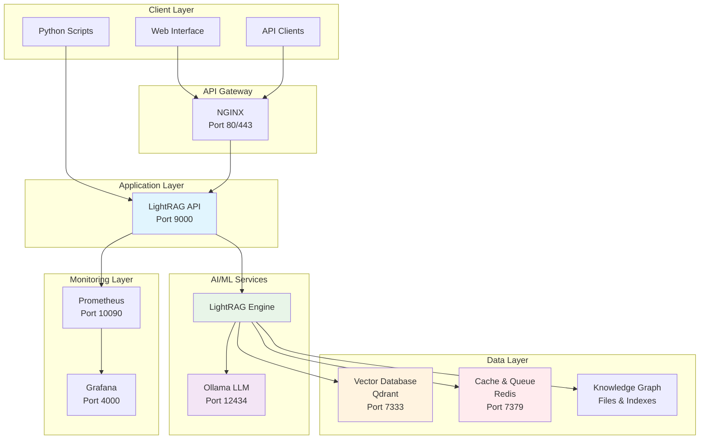
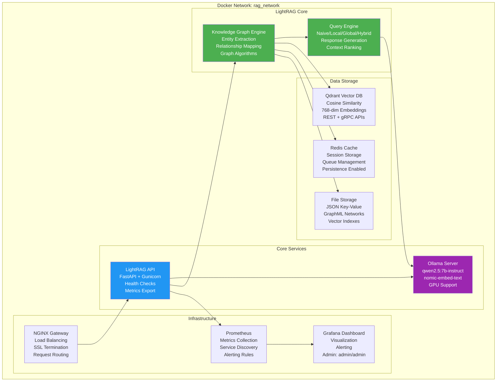
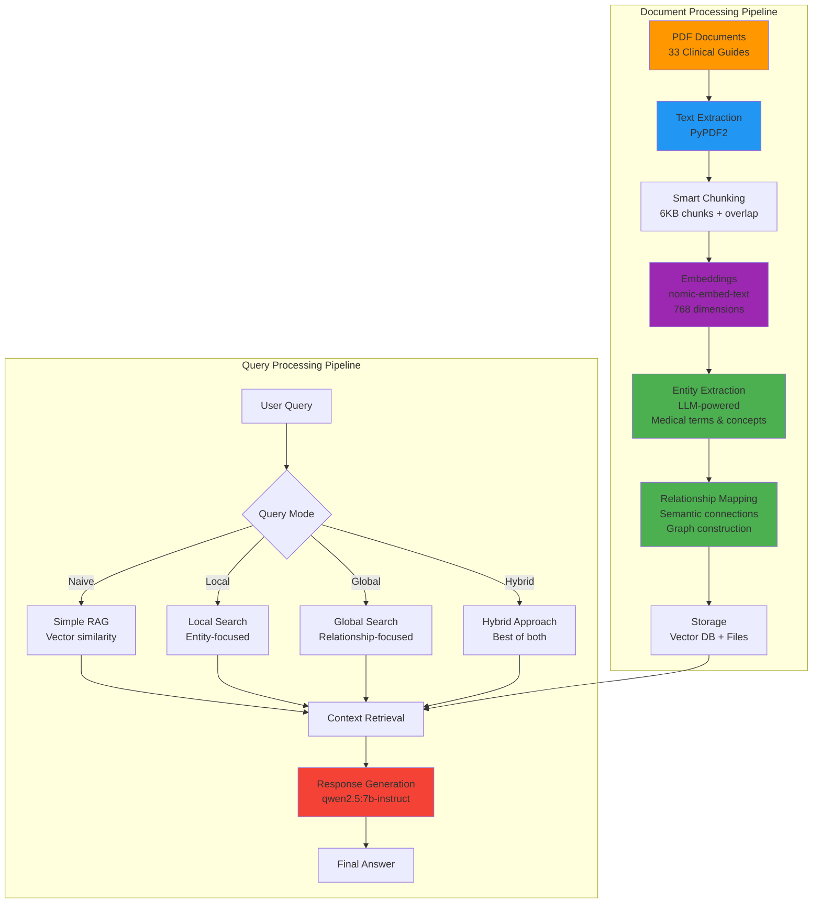
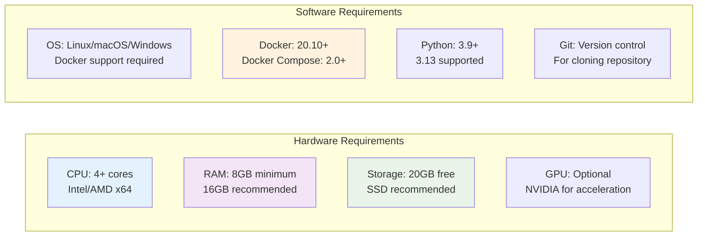
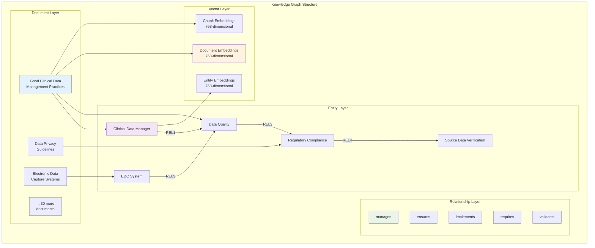
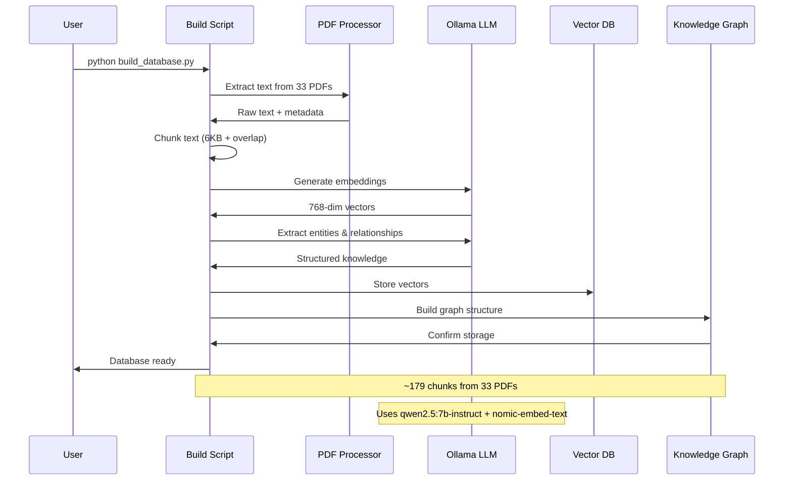
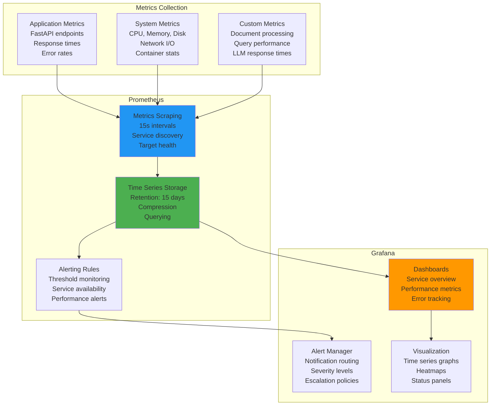
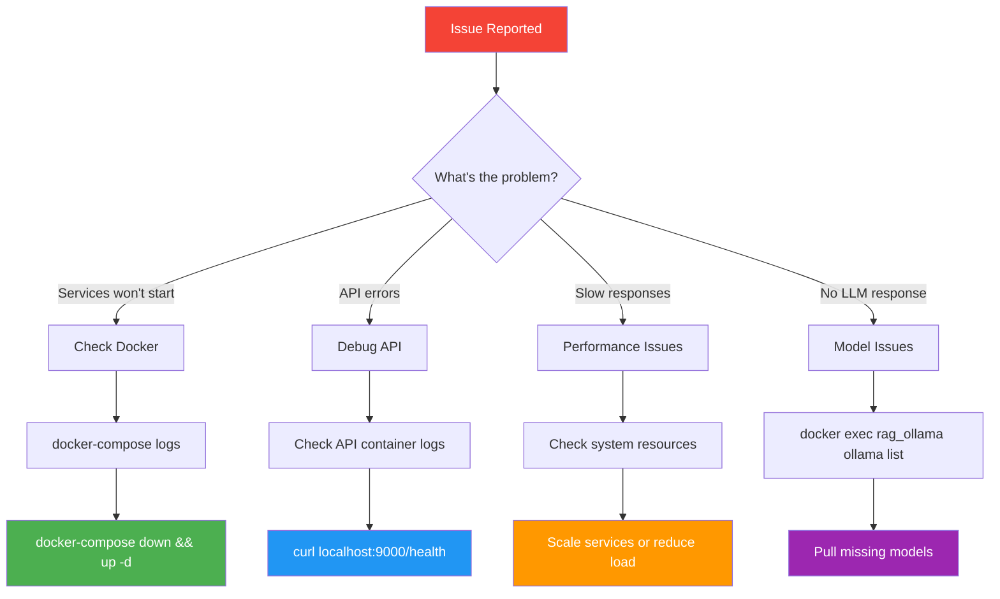

# LightRAG Clinical Data Management System: Complete Setup and Implementation Guide

## Table of Contents
1. [System Overview](#system-overview)
2. [Architecture](#architecture)
3. [Evolution and Development History](#evolution-and-development-history)
4. [Prerequisites](#prerequisites)
5. [Step-by-Step Setup](#step-by-step-setup)
6. [Usage Guide](#usage-guide)
7. [Knowledge Graph Database](#knowledge-graph-database)
8. [Monitoring and Observability](#monitoring-and-observability)
9. [Troubleshooting](#troubleshooting)
10. [Advanced Configuration](#advanced-configuration)

## System Overview

The LightRAG Clinical Data Management System is a comprehensive Retrieval-Augmented Generation (RAG) platform specifically designed for clinical research and data management. It combines advanced AI capabilities with robust infrastructure to create an intelligent knowledge graph from clinical documents and provides sophisticated querying capabilities.

### Key Features

- **Multi-Modal Knowledge Graph**: Automatically extracts entities and relationships from clinical documents
- **Advanced Query Modes**: Supports naive, local, global, and hybrid search strategies
- **Local LLM Integration**: Uses Ollama for complete data privacy and control
- **Scalable Architecture**: Microservices-based design with Docker containerization
- **Comprehensive Monitoring**: Prometheus metrics and Grafana dashboards
- **Clinical Focus**: Pre-loaded with 33 clinical data management PDF documents

## Architecture

### High-Level System Architecture



### Detailed Service Architecture



### Data Flow Architecture



## Evolution and Development History

Based on git commit history, the system evolved through several key phases:

### Phase 1: Foundation (Initial Commit - 8a47092)
- Initial project structure with basic RAG capabilities
- Docker containerization setup
- Basic API endpoint definitions

### Phase 2: Python 3.13 Compatibility (8a47092 - 6b9c26d)
- **Challenge**: LightRAG dependency issues with Python 3.13
- **Solution**: Direct integration of LightRAG into repository with patches
- **Commit 8a47092**: Added LightRAG Python 3.13 compatibility patch
- **Commit 6b9c26d**: Included LightRAG directly with modifications

**Key LightRAG Modifications Made:**
```python
# Fixed graspologic dependency issue in networkx_impl.py
# graspologic is not compatible with Python 3.13
# Removed unnecessary dependency that wasn't actually used
```

### Phase 3: Comprehensive Testing and Documentation (b0181ad - 58d70a1)
- **Commit b0181ad**: Added comprehensive test suite
- **Commit 58d70a1**: Enhanced test documentation and Redis detection
- Implemented integration, unit, and performance tests

### Phase 4: Production Readiness (903d0e6 - 06716bf)
- **Commit 903d0e6**: Added service documentation and connection examples
- **Commit 06716bf**: Integrated Mermaid architecture diagrams
- Enhanced monitoring and observability

### Phase 5: vLLM Migration Analysis (530431d - df323c7)
- **Challenge**: Evaluating vLLM vs Ollama for production deployment
- **Analysis**: Comprehensive comparison of both approaches
- **Decision**: Chose Ollama for simplicity and integrated embeddings

### Phase 6: Clean Ollama Implementation (25874a0)
- **Current State**: Clean, production-ready Ollama-based system
- Streamlined architecture focused on clinical data management
- Comprehensive documentation and tutorials

## Prerequisites

### System Requirements



### Software Dependencies
- **Docker**: 20.10+ with Docker Compose
- **Python**: 3.9+ (3.13 fully supported)
- **Git**: For repository cloning
- **8GB+ RAM**: For LLM operations
- **20GB+ Storage**: For models and data

## Step-by-Step Setup

### Step 1: Repository Clone and Setup

```bash
# Clone the repository
git clone <your-repository-url>
cd llm_backend

# Check Python version (should be 3.9+)
python --version

# Install dependencies
pip install -r requirements.txt
```

### Step 2: Environment Configuration

```bash
# Copy environment template
cp .env.example .env

# Edit environment variables (optional)
nano .env
```

**Key Environment Variables:**
```bash
# LLM Configuration
LLM_MODEL=qwen2.5:7b-instruct
EMBEDDING_MODEL=nomic-embed-text

# Service Ports (updated to avoid conflicts)
API_PORT=9000
OLLAMA_PORT=12434
QDRANT_PORT=7333
REDIS_PORT=7379
PROMETHEUS_PORT=10090
GRAFANA_PORT=4000
```

### Step 3: Docker Services Startup

```bash
# Start all services
docker-compose up -d

# Verify services are running
docker-compose ps
```

**Expected Output:**
```
NAME             IMAGE                      STATUS                PORTS
rag_api          llm_backend-lightrag-api   Up (healthy)         0.0.0.0:9000->8000/tcp
rag_grafana      grafana/grafana:latest     Up                   0.0.0.0:4000->3000/tcp
rag_ollama       ollama/ollama:latest       Up                   0.0.0.0:12434->11434/tcp
rag_prometheus   prom/prometheus:latest     Up                   0.0.0.0:10090->9090/tcp
rag_qdrant       qdrant/qdrant:v1.10.1      Up                   0.0.0.0:7333->6333/tcp
rag_redis        redis:7-alpine             Up                   0.0.0.0:7379->6379/tcp
```

### Step 4: Model Download and Initialization

```bash
# Wait for Ollama to start (may take 2-3 minutes)
sleep 180

# Pull required models
docker exec rag_ollama ollama pull qwen2.5:7b-instruct
docker exec rag_ollama ollama pull nomic-embed-text

# Verify models are available
docker exec rag_ollama ollama list
```

### Step 5: System Verification

```bash
# Test basic functionality
python test_basic_functionality.py

# Test all service connections
python examples/connect_to_services.py
```

### Step 6: Build Knowledge Graph Database

```bash
# Quick demo with 5 PDFs (10 minutes)
python demo_database.py

# OR full database with all 33 PDFs (60 minutes)
python build_database.py
```

## Usage Guide

### Service Access Points

```mermaid
graph LR
    subgraph "External Access"
        API_URL[API: http://localhost:9000]
        GRAF_URL[Grafana: http://localhost:4000]
        PROM_URL[Prometheus: http://localhost:10090]
        OLLAMA_URL[Ollama: http://localhost:12434]
    end
    
    subgraph "Health Checks"
        API_HEALTH[/health endpoint]
        SERVICE_STATUS[docker-compose ps]
        METRICS[/metrics endpoints]
    end
    
    API_URL --> API_HEALTH
    SERVICE_STATUS --> API_URL
    SERVICE_STATUS --> GRAF_URL
    METRICS --> PROM_URL
```

### Basic API Usage

#### 1. Document Insertion
```bash
curl -X POST "http://localhost:9000/documents" \
  -H "Content-Type: application/json" \
  -d '{
    "documents": [
      "Clinical data management involves systematic collection and analysis of clinical trial data."
    ]
  }'
```

#### 2. Knowledge Graph Querying

**Naive Mode (Simple RAG):**
```bash
curl -X POST "http://localhost:9000/query" \
  -H "Content-Type: application/json" \
  -d '{
    "question": "What is clinical data management?",
    "mode": "naive"
  }'
```

**Local Mode (Entity-focused):**
```bash
curl -X POST "http://localhost:9000/query" \
  -H "Content-Type: application/json" \
  -d '{
    "question": "What are the key principles of data privacy?",
    "mode": "local"
  }'
```

**Global Mode (Relationship-focused):**
```bash
curl -X POST "http://localhost:9000/query" \
  -H "Content-Type: application/json" \
  -d '{
    "question": "How do different data management processes relate?",
    "mode": "global"
  }'
```

**Hybrid Mode (Best of both):**
```bash
curl -X POST "http://localhost:9000/query" \
  -H "Content-Type: application/json" \
  -d '{
    "question": "What are the best practices for clinical data management?",
    "mode": "hybrid"
  }'
```

### Python SDK Usage

```python
import asyncio
from src.rag.lightrag_service import LightRAGService

async def example_usage():
    # Initialize service
    service = LightRAGService(
        working_dir="./my_rag_data",
        llm_model="qwen2.5:7b-instruct",
        embedding_model="nomic-embed-text"
    )
    
    await service.initialize()
    
    # Insert documents
    documents = [
        "Electronic Data Capture systems improve clinical trial efficiency.",
        "Good Clinical Data Management Practices ensure data quality."
    ]
    await service.insert_documents(documents)
    
    # Query with different modes
    response = await service.query(
        "How do EDC systems improve clinical trials?",
        mode="hybrid"
    )
    print(response)
    
    await service.close()

# Run the example
asyncio.run(example_usage())
```

## Knowledge Graph Database

### Database Architecture



### Database Building Process



### Clinical Knowledge Coverage

The system includes comprehensive coverage of:

1. **Clinical Data Management Practices**
2. **Data Privacy and Regulatory Compliance**  
3. **Electronic Data Capture Systems**
4. **Database Design and Validation**
5. **Quality Assurance Processes**
6. **Project Management for Clinical Data**
7. **Safety Data Management**
8. **Training and Metrics**
9. **Data Storage and Archiving**
10. **Medical Coding and Dictionaries**

## Monitoring and Observability

### Monitoring Stack



### Key Metrics Tracked

- **API Performance**: Response times, throughput, error rates
- **LLM Operations**: Token generation speed, embedding creation time
- **Database Operations**: Vector search latency, insertion rates
- **System Resources**: CPU, memory, disk usage per service
- **Business Metrics**: Documents processed, queries served, user activity

### Grafana Dashboard Access

1. **URL**: http://localhost:4000
2. **Credentials**: admin/admin
3. **Pre-configured Dashboards**:
   - System Overview
   - API Performance
   - LLM Metrics
   - Database Performance

## Troubleshooting

### Common Issues and Solutions



### Debug Commands

```bash
# Check all service status
docker-compose ps

# View logs for specific services
docker-compose logs ollama
docker-compose logs api
docker-compose logs qdrant

# Test individual components
python test_basic_functionality.py
python examples/connect_to_services.py

# Health checks
curl http://localhost:9000/health
curl http://localhost:12434/api/version
curl http://localhost:7333/health

# Resource usage
docker stats

# Restart specific service
docker-compose restart ollama
```

## Advanced Configuration

### Custom Model Configuration

```yaml
# In docker-compose.yml, modify environment variables
environment:
  - LLM_MODEL=qwen2.5:32b-instruct  # Larger model
  - EMBEDDING_MODEL=mxbai-embed-large  # Different embedding model
  - RAG_CHUNK_SIZE=8000  # Larger chunks
  - RAG_OVERLAP=1000  # More overlap
```

### Scaling Configuration

```yaml
# For production deployment
deploy:
  replicas: 3  # Multiple API instances
  resources:
    limits:
      memory: 8G
      cpus: '4.0'
    reservations:
      memory: 4G
      cpus: '2.0'
```

### Performance Tuning

```python
# Custom LightRAG configuration
service = LightRAGService(
    working_dir="./production_rag",
    llm_model="qwen2.5:32b-instruct",
    embedding_model="mxbai-embed-large",
    embedding_dim=1024,  # Higher dimension
    chunk_size=8000,     # Larger chunks
    chunk_overlap=1000   # More overlap
)
```

## Conclusion

The LightRAG Clinical Data Management System represents a sophisticated, production-ready solution for intelligent document processing and knowledge extraction in clinical research environments. Through its multi-layered architecture, comprehensive monitoring, and clinical domain focus, it provides a robust foundation for advanced clinical data analysis and decision support.

The system's evolution from a basic RAG implementation to a comprehensive clinical knowledge platform demonstrates careful consideration of real-world requirements, including Python 3.13 compatibility, local deployment constraints, and clinical domain expertise.

For production deployment, consider:
- Scaling Ollama instances for higher throughput
- Implementing authentication and authorization
- Adding data backup and disaster recovery
- Customizing models for specific clinical domains
- Integrating with existing clinical workflows

The combination of LightRAG's graph-based approach with Ollama's local deployment capabilities creates a powerful, privacy-preserving solution ideal for clinical research environments where data security and compliance are paramount.