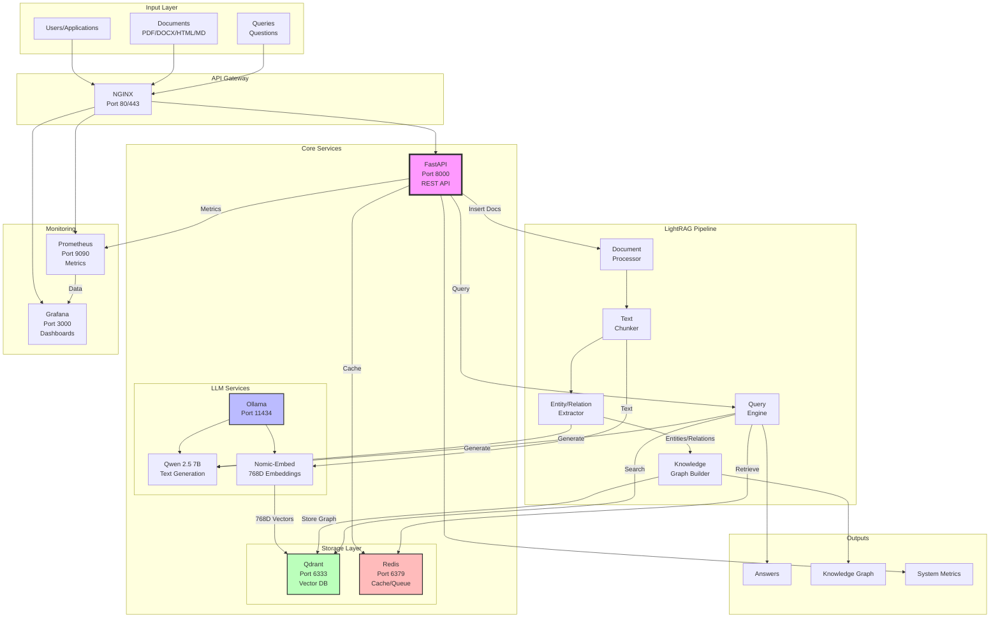

# LightRAG Production API

A production-ready RAG (Retrieval-Augmented Generation) system built with LightRAG, featuring knowledge graphs, multi-modal document processing, and comprehensive monitoring.

## 📚 Documentation

| Document | Description |
|----------|-------------|
| [QUICK_REFERENCE.md](QUICK_REFERENCE.md) | Quick commands, URLs, and common operations |
| [SERVICES.md](SERVICES.md) | Detailed guide for all 7 services |
| [TESTING.md](TESTING.md) | Comprehensive testing documentation |
| [ARCHITECTURE.md](ARCHITECTURE.md) | System design and architecture |
| [DEPLOYMENT.md](DEPLOYMENT.md) | Production deployment guide |

## 🚀 Features

- **Graph-based RAG**: Enhanced retrieval using knowledge graphs with entities and relationships
- **Multi-format Document Support**: PDF, DOCX, PPTX, XLSX, HTML, and Markdown via Docling
- **Multiple Query Modes**: Naive, local (entity-focused), global (community-focused), and hybrid
- **Production Ready**: Authentication, rate limiting, monitoring, structured logging
- **Scalable Architecture**: Docker-based microservices with horizontal scaling support
- **Real-time Monitoring**: Prometheus metrics with Grafana dashboards
- **API Gateway**: NGINX with rate limiting and SSL termination

## 🏗️ System Architecture



### Data Flow Description

1. **Input Types**:
   - **Documents**: PDF, DOCX, PPTX, XLSX, HTML, Markdown
   - **Queries**: Natural language questions
   - **Modes**: Naive, Local, Global, Hybrid

2. **Processing Pipeline**:
   - Documents → Chunking → Entity/Relation Extraction → Knowledge Graph
   - Text → Embeddings → Vector Storage
   - Queries → Vector Search + Graph Traversal → Answer Generation

3. **Output Types**:
   - **Answers**: Context-aware responses using RAG
   - **Knowledge Graph**: Entities and relationships visualization
   - **Metrics**: Performance and usage statistics

## 📋 Prerequisites

- Docker and Docker Compose
- NVIDIA GPU with 8GB+ VRAM (for local LLM inference)
- 16GB+ RAM
- 50GB+ free disk space

## 🛠 Quick Start

### 1. Clone and Setup

```bash
git clone <repository-url>
cd llm_backend

# Install LightRAG (included with Python 3.13 fixes)
cd LightRAG
pip install -e .
cd ..

# Copy environment configuration
cp .env.example .env
```

### 2. Configure Environment

Edit `.env` file with your settings:

```bash
# Essential settings
RAG_API_KEY_ENABLED=true
RAG_API_KEYS=your-secret-api-key-here
RAG_LLM_MODEL=qwen2.5:7b-instruct  # or qwen2.5:32b-instruct for better quality
```

### 3. Start Services

```bash
# Start all services
docker-compose up -d

# Pull required models
docker exec rag_ollama ollama pull qwen2.5:7b-instruct
docker exec rag_ollama ollama pull nomic-embed-text

# Check service health
curl http://localhost:8000/health
```

### 4. Test the API

```bash
# Insert documents
curl -X POST "http://localhost:8000/documents" \
  -H "Content-Type: application/json" \
  -H "X-API-Key: your-secret-api-key-here" \
  -d '{
    "documents": [
      "LightRAG is a powerful framework for building RAG systems with knowledge graphs.",
      "It supports multiple query modes and provides excellent performance."
    ]
  }'

# Query the knowledge base
curl -X POST "http://localhost:8000/query" \
  -H "Content-Type: application/json" \
  -H "X-API-Key: your-secret-api-key-here" \
  -d '{
    "question": "What is LightRAG?",
    "mode": "hybrid"
  }'
```

## 📚 API Documentation

### Base URL
- Development: `http://localhost:8000`
- Production: `https://your-domain.com`

### Authentication
All endpoints require an API key in the header:
```
X-API-Key: your-secret-api-key
```

### Core Endpoints

#### `POST /documents`
Insert documents into the knowledge base.

**Request:**
```json
{
  "documents": ["text content 1", "text content 2"]
}
```

**Response:**
```json
{
  "success": true,
  "message": "Successfully processed 2 documents",
  "documents_processed": 2,
  "processing_time": 1.23,
  "timestamp": "2024-01-01T00:00:00Z"
}
```

#### `POST /query`
Query the knowledge base.

**Request:**
```json
{
  "question": "What is the main topic?",
  "mode": "hybrid",
  "stream": false,
  "top_k": 10,
  "include_sources": true
}
```

**Response:**
```json
{
  "success": true,
  "answer": "Based on the knowledge base...",
  "mode": "hybrid",
  "sources": [...],
  "processing_time": 0.85,
  "timestamp": "2024-01-01T00:00:00Z"
}
```

#### Query Modes
- **naive**: Simple text similarity search
- **local**: Entity-focused retrieval with local graph context
- **global**: Community-focused retrieval with global graph context  
- **hybrid**: Combines local and global approaches (recommended)

#### `GET /graph`
Retrieve knowledge graph structure.

**Response:**
```json
{
  "nodes": [{"id": "entity1", "type": "CONCEPT", "properties": {...}}],
  "edges": [{"source": "entity1", "target": "entity2", "type": "RELATES_TO"}],
  "stats": {"node_count": 50, "edge_count": 120},
  "timestamp": "2024-01-01T00:00:00Z"
}
```

### Health & Monitoring

#### `GET /health`
Basic health check.

#### `GET /health/ready`
Detailed readiness check for all services.

#### `GET /metrics`
Prometheus metrics endpoint.

### Administrative

#### `GET /`
API information and feature list.

## 🔧 Configuration

### Environment Variables

All configuration is handled via environment variables with the `RAG_` prefix:

#### API Settings
```bash
RAG_API_HOST=0.0.0.0
RAG_API_PORT=8000
RAG_API_WORKERS=4
RAG_API_TITLE="LightRAG Production API"
```

#### Security
```bash
RAG_API_KEY_ENABLED=true
RAG_API_KEYS=key1,key2,key3
RAG_CORS_ORIGINS=https://myapp.com,https://admin.myapp.com
RAG_MAX_REQUEST_SIZE=10485760  # 10MB
```

#### Models
```bash
RAG_LLM_MODEL=qwen2.5:7b-instruct
RAG_EMBEDDING_MODEL=nomic-embed-text
RAG_LLM_TIMEOUT=300
```

#### Rate Limiting
```bash
RAG_RATE_LIMIT_REQUESTS=60  # requests per minute
RAG_RATE_LIMIT_WINDOW=60    # window in seconds
```

### Model Selection Guide

| Model | VRAM Required | Speed | Quality | Use Case |
|-------|---------------|-------|---------|----------|
| qwen2.5:7b-instruct | 8GB | Fast | Good | Development, high throughput |
| qwen2.5:32b-instruct | 20GB | Medium | Better | Production, balanced |
| llama3.3:70b-instruct | 48GB+ | Slow | Best | Research, highest quality |

## 🚀 Deployment

### Production Deployment

1. **Set Production Environment**:
```bash
RAG_API_KEY_ENABLED=true
RAG_API_KEYS=generate-strong-keys-here
RAG_LOG_LEVEL=INFO
RAG_CORS_ORIGINS=https://your-domain.com
```

2. **Configure SSL in NGINX**:
```bash
# Edit configs/nginx/conf.d/api-gateway.conf
# Add SSL certificates and redirect HTTP to HTTPS
```

3. **Scale Services**:
```bash
# Scale API instances
docker-compose up -d --scale lightrag-api=3

# Use external Redis/Qdrant for high availability
```

4. **Set up Monitoring**:
- Grafana: `http://localhost:3000` (admin/admin)
- Prometheus: `http://localhost:9090`
- Configure alerts for critical metrics

### Docker Deployment

```bash
# Build and start all services
docker-compose up -d --build

# View logs
docker-compose logs -f lightrag-api

# Scale horizontally
docker-compose up -d --scale lightrag-api=3
```

### Kubernetes Deployment

```bash
# Generate Kubernetes manifests
kompose convert

# Apply manifests
kubectl apply -f .
```

## 📊 Monitoring

### Prometheus Metrics

Key metrics exposed at `/metrics`:

- `http_requests_total`: Request counter by method, endpoint, status
- `http_request_duration_seconds`: Request latency histogram
- `documents_processed_total`: Documents processed counter
- `queries_processed_total`: Queries processed by mode
- `rag_service_initialized`: Service health gauge
- `auth_failures_total`: Authentication failures
- `rate_limit_hits_total`: Rate limiting violations

### Grafana Dashboards

Pre-configured dashboards available:

- **API Overview**: Request rates, latency, error rates
- **Service Health**: Component health and dependencies
- **Business Metrics**: Document processing, query patterns
- **Performance**: Resource usage, bottlenecks

Access: `http://localhost:3000` (admin/admin)

### Log Aggregation

Structured JSON logs with correlation IDs:

```json
{
  "timestamp": "2024-01-01T00:00:00Z",
  "level": "INFO",
  "logger": "api.request",
  "correlation_id": "req-123",
  "message": "Request completed",
  "method": "POST",
  "endpoint": "/documents",
  "status_code": 200,
  "response_time_ms": 1234
}
```

## 🔍 Troubleshooting

### Common Issues

#### Service Won't Start
```bash
# Check service logs
docker-compose logs lightrag-api

# Verify models are available
docker exec rag_ollama ollama list

# Check health endpoints
curl http://localhost:8000/health/ready
```

#### Out of Memory
```bash
# Use smaller model
RAG_LLM_MODEL=qwen2.5:7b-instruct

# Reduce worker count
RAG_API_WORKERS=2

# Monitor memory usage
docker stats
```

#### Slow Performance
```bash
# Check GPU utilization
nvidia-smi

# Enable caching
RAG_ENABLE_CACHING=true

# Tune chunk size
RAG_CHUNK_SIZE=800
```

#### Authentication Issues
```bash
# Verify API key format
RAG_API_KEYS=key1,key2,key3

# Check authentication in logs
docker-compose logs lightrag-api | grep auth
```

### Performance Optimization

1. **Model Selection**: Choose appropriate model for your use case
2. **Caching**: Enable Redis caching for frequent queries
3. **Chunking**: Optimize chunk size and overlap for your documents
4. **Scaling**: Use multiple API instances behind load balancer
5. **GPU**: Ensure GPU is available and properly configured

## 🧪 Development

### Local Development

```bash
# Install dependencies
pip install -r requirements.txt

# Start external services only
docker-compose up -d qdrant ollama redis prometheus grafana

# Run API locally
python -m src.api.main
```

### Testing

The project includes a comprehensive test suite with 100+ tests covering unit, integration, infrastructure, and performance testing.

**Quick Start:**
```bash
# Run all tests with the test runner
python run_tests.py

# Run specific test categories
python run_tests.py --unit
python run_tests.py --integration
python run_tests.py --infrastructure
```

For detailed testing documentation, see [TESTING.md](TESTING.md).

### Code Quality

```bash
# Format code
black src/
isort src/

# Lint code
flake8 src/
mypy src/
```

## 📝 API Integration Examples

### Python Client

```python
import requests
import json

class LightRAGClient:
    def __init__(self, base_url, api_key):
        self.base_url = base_url.rstrip('/')
        self.headers = {
            'Content-Type': 'application/json',
            'X-API-Key': api_key
        }
    
    def insert_documents(self, documents):
        response = requests.post(
            f"{self.base_url}/documents",
            headers=self.headers,
            json={"documents": documents}
        )
        return response.json()
    
    def query(self, question, mode="hybrid"):
        response = requests.post(
            f"{self.base_url}/query",
            headers=self.headers,
            json={"question": question, "mode": mode}
        )
        return response.json()

# Usage
client = LightRAGClient("http://localhost:8000", "your-api-key")

# Insert documents
result = client.insert_documents([
    "Document content here...",
    "Another document..."
])

# Query
answer = client.query("What is the main topic?")
print(answer['answer'])
```

### JavaScript/Node.js Client

```javascript
class LightRAGClient {
    constructor(baseURL, apiKey) {
        this.baseURL = baseURL.replace(/\/$/, '');
        this.apiKey = apiKey;
    }
    
    async request(endpoint, method = 'GET', data = null) {
        const url = `${this.baseURL}${endpoint}`;
        const options = {
            method,
            headers: {
                'Content-Type': 'application/json',
                'X-API-Key': this.apiKey
            }
        };
        
        if (data) {
            options.body = JSON.stringify(data);
        }
        
        const response = await fetch(url, options);
        return response.json();
    }
    
    async insertDocuments(documents) {
        return this.request('/documents', 'POST', { documents });
    }
    
    async query(question, mode = 'hybrid') {
        return this.request('/query', 'POST', { question, mode });
    }
}

// Usage
const client = new LightRAGClient('http://localhost:8000', 'your-api-key');

// Insert documents
const result = await client.insertDocuments([
    'Document content here...',
    'Another document...'
]);

// Query
const answer = await client.query('What is the main topic?');
console.log(answer.answer);
```

### cURL Examples

```bash
# Insert documents
curl -X POST "http://localhost:8000/documents" \
  -H "Content-Type: application/json" \
  -H "X-API-Key: your-api-key" \
  -d '{
    "documents": [
      "First document content",
      "Second document content"
    ]
  }'

# Query with different modes
curl -X POST "http://localhost:8000/query" \
  -H "Content-Type: application/json" \
  -H "X-API-Key: your-api-key" \
  -d '{
    "question": "What are the main topics?",
    "mode": "hybrid",
    "include_sources": true
  }'

# Get knowledge graph
curl -X GET "http://localhost:8000/graph" \
  -H "X-API-Key: your-api-key"

# Health check
curl -X GET "http://localhost:8000/health/ready"
```

## 🤝 Contributing

1. Fork the repository
2. Create a feature branch: `git checkout -b feature-name`
3. Make changes and add tests
4. Run quality checks: `black src/ && flake8 src/ && pytest`
5. Commit changes: `git commit -am 'Add feature'`
6. Push to branch: `git push origin feature-name`
7. Create Pull Request

## 📄 License

This project is licensed under the MIT License. See LICENSE file for details.

## 🆘 Support

- Documentation: Check this README and API docs at `/api/docs`
- Issues: Create GitHub issues for bugs and feature requests
- Discussions: Use GitHub discussions for questions and ideas

## 🔗 Related Projects

- [LightRAG](https://github.com/HKUDS/LightRAG): Core RAG framework
- [Docling](https://github.com/DS4SD/docling): Document parsing library
- [Ollama](https://ollama.ai/): Local LLM inference
- [Qdrant](https://qdrant.tech/): Vector database