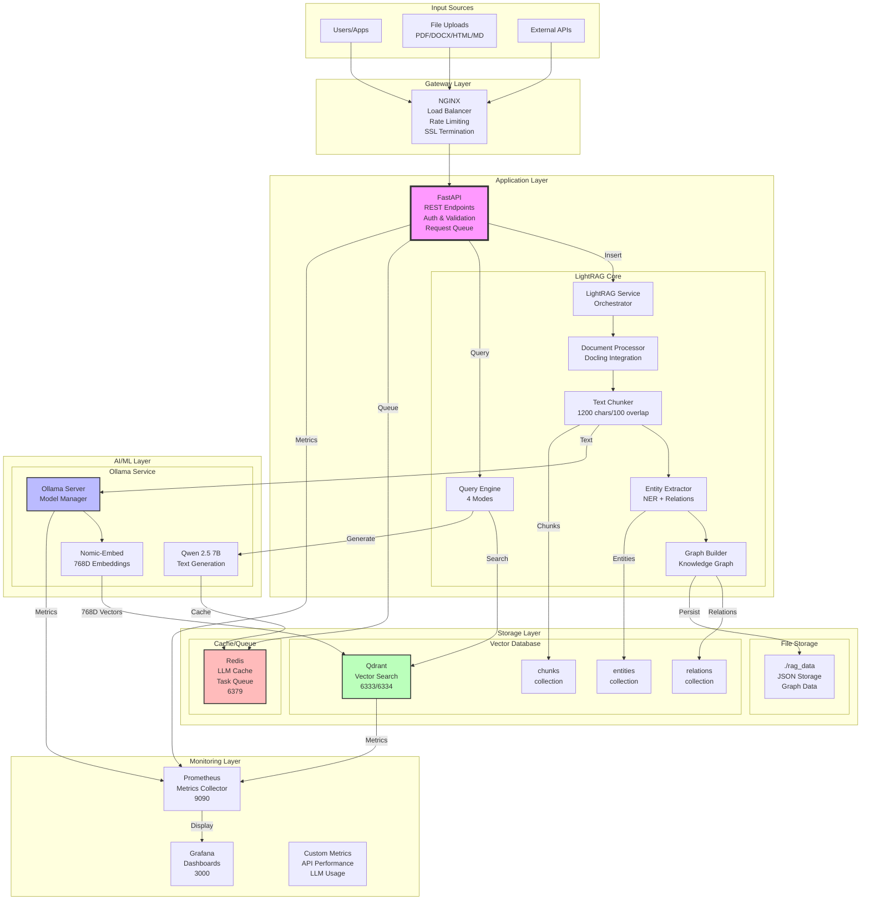
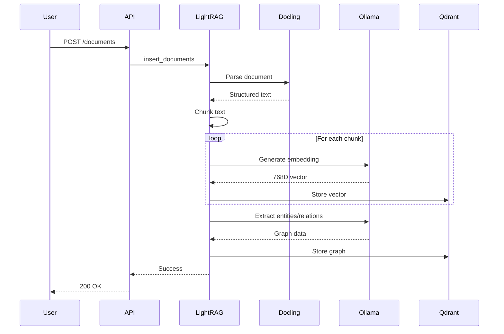
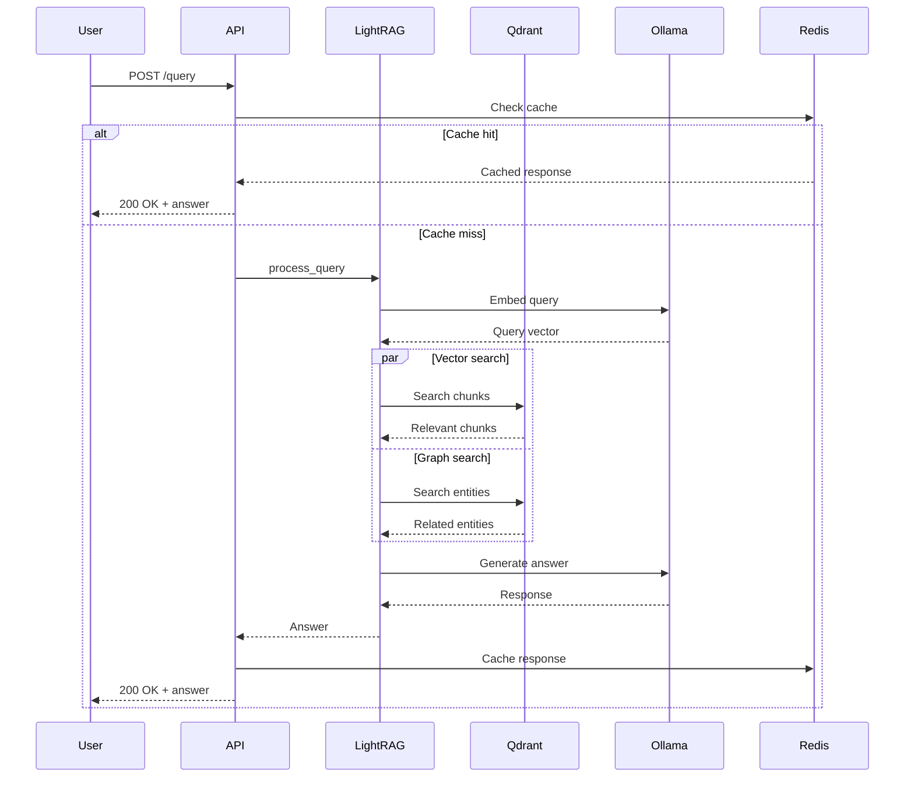
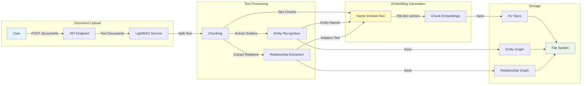
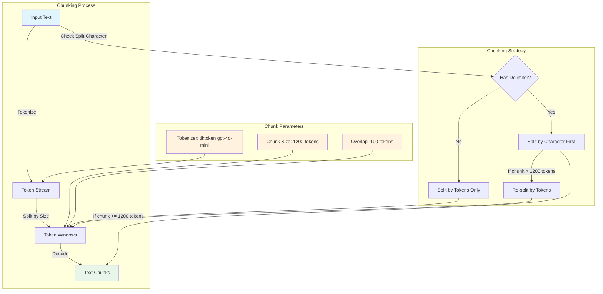
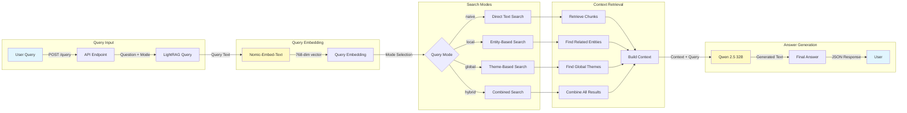
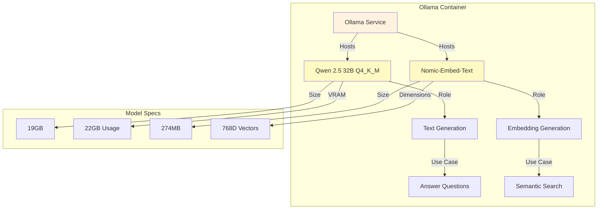

# LightRAG Architecture & Data Flow

## System Overview



## Detailed Component Interactions

### Document Processing Pipeline



### Query Processing Pipeline



    subgraph "Query Modes"
        F -->|Naive Mode| L[Direct Search]
        F -->|Local Mode| M[Entity Search]
        F -->|Global Mode| N[Theme Search]
        F -->|Hybrid Mode| O[Combined Search]
    end

    subgraph "Monitoring"
        C -->|Metrics| P[Prometheus]
        P -->|Visualize| Q[Grafana]
    end

    style A fill:#e1f5fe
    style B fill:#fff3e0
    style C fill:#f3e5f5
    style D fill:#e8f5e9
    style G fill:#fff9c4
    style H fill:#fff9c4
    style P fill:#ffebee
    style Q fill:#ffebee
```

## Document Ingestion Flow



## Document Chunking Details



### How Chunking Works

1. **Token-Based Chunking**
   - Uses tiktoken tokenizer (gpt-4o-mini model)
   - Default chunk size: 1200 tokens
   - Default overlap: 100 tokens
   - Configurable via environment variables:
     - `CHUNK_SIZE` (default: 1200)
     - `CHUNK_OVERLAP_SIZE` (default: 100)

2. **Chunking Algorithm**
   ```python
   # Simplified logic from chunking_by_token_size
   for start in range(0, total_tokens, chunk_size - overlap):
       chunk = tokens[start : start + chunk_size]
       yield decode(chunk)
   ```

3. **Smart Splitting Options**
   - **Character-based splitting**: Can split by sentence, paragraph, or custom delimiter
   - **Hybrid approach**: Split by character first, then by tokens if chunks are too large
   - **Overlap preservation**: Maintains context between chunks

4. **Why These Settings?**
   - **1200 tokens**: Balances context preservation with processing efficiency
   - **100 token overlap**: Ensures entities/relationships aren't cut off at boundaries
   - **tiktoken**: Industry-standard tokenizer, consistent with OpenAI models

## Query Processing Flow



## Model Locations & Roles



## End User Journey

```mermaid
graph TD
    subgraph "Step 1: Upload Documents"
        U1[User] -->|Prepare Text| D1[Document Collection]
        D1 -->|HTTP POST| D2[/api/documents]
        D2 -->|Process| D3[Knowledge Graph Built]
    end

    subgraph "Step 2: Ask Questions"
        U1 -->|Write Question| Q1[Query]
        Q1 -->|Choose Mode| Q2[Select Query Type]
        Q2 -->|HTTP POST| Q3[/api/query]
    end

    subgraph "Step 3: Get Answers"
        Q3 -->|Process| A1[LightRAG Search]
        A1 -->|Generate| A2[Contextual Answer]
        A2 -->|Return| A3[JSON Response]
        A3 -->|Display| U1
    end

    style U1 fill:#e1f5fe
    style D3 fill:#e8f5e9
    style A3 fill:#e8f5e9
```

## API Usage Examples

### 1. Upload Documents
```bash
curl -X POST http://localhost/api/documents \
  -H "Content-Type: application/json" \
  -d '{
    "documents": [
      "RAG combines retrieval with generation for accurate answers.",
      "LightRAG uses knowledge graphs to improve search quality."
    ]
  }'
```

### 2. Query with Different Modes
```bash
# Naive Mode - Simple text search
curl -X POST http://localhost/api/query \
  -H "Content-Type: application/json" \
  -d '{
    "question": "What is RAG?",
    "mode": "naive"
  }'

# Local Mode - Entity-focused search
curl -X POST http://localhost/api/query \
  -H "Content-Type: application/json" \
  -d '{
    "question": "How does LightRAG work?",
    "mode": "local"
  }'

# Global Mode - Theme-based search
curl -X POST http://localhost/api/query \
  -H "Content-Type: application/json" \
  -d '{
    "question": "What are the benefits of knowledge graphs?",
    "mode": "global"
  }'

# Hybrid Mode - Combined approach
curl -X POST http://localhost/api/query \
  -H "Content-Type: application/json" \
  -d '{
    "question": "Explain the complete RAG architecture",
    "mode": "hybrid"
  }'
```

## Key Components Explained

### LightRAG Storage
- **Entity Graph**: Stores identified entities and their properties
- **Relationship Graph**: Stores connections between entities
- **Text Chunks**: Original document segments with metadata
- **KV Store**: Key-value storage for fast retrieval

### Query Modes
- **Naive**: Direct text similarity search without graph features
- **Local**: Focuses on specific entities and their immediate connections
- **Global**: Looks for overarching themes and concepts
- **Hybrid**: Combines all approaches for comprehensive results

### Why This Architecture?
1. **Graph-based**: Better context understanding than simple vector search
2. **Multi-modal search**: Different query modes for different needs
3. **Scalable**: Can handle large document collections
4. **Observable**: Full monitoring and metrics
5. **Flexible**: Easy to add new models or change configurations