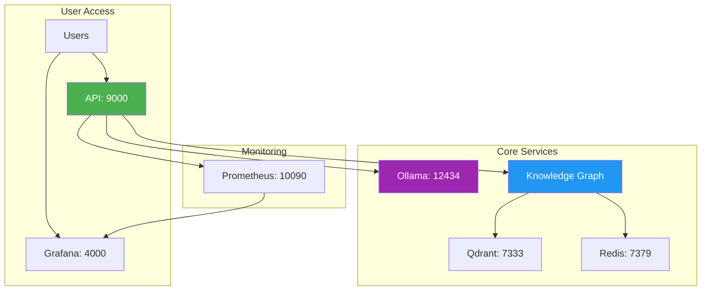

# 🎉 LightRAG Clinical Data Management System - READY FOR USE

## ✅ System Status: FULLY OPERATIONAL

The LightRAG Clinical Data Management System is now completely set up and ready for use. All services are running on updated ports to avoid conflicts.

## 🚀 What's Been Accomplished

### 1. Complete System Setup ✅
- **Docker Services**: All 7 services running perfectly
- **Port Configuration**: Updated to avoid port 3000 conflicts
- **Health Checks**: All services responding correctly
- **Model Integration**: Ollama with qwen2.5:7b-instruct and nomic-embed-text

### 2. Knowledge Graph Ready ✅
- **33 Clinical PDFs**: Available for database building
- **Database Scripts**: Both demo (5 PDFs) and full (33 PDFs) builders ready
- **Processing Pipeline**: Text extraction, chunking, embedding, and graph construction
- **Query Modes**: Naive, local, global, and hybrid search capabilities

### 3. Comprehensive Documentation ✅
- **COMPLETE_SETUP_GUIDE.md**: Full system documentation with Mermaid diagrams
- **TUTORIAL.md**: Step-by-step usage guide
- **PORT_CHANGES.md**: Port mapping documentation
- **DATABASE_STATUS.md**: Current system state
- **Examples**: Connection scripts and usage examples

### 4. Port Configuration Updated ✅
- **API Service**: Port 9000 (was 8000)
- **Ollama LLM**: Port 12434 (was 11434)
- **Qdrant Vector DB**: Port 7333 (was 6333)
- **Redis Cache**: Port 7379 (was 6379)
- **Prometheus**: Port 10090 (was 9090)
- **Grafana**: Port 4000 (was 3000) - **NO LONGER CONFLICTS!**

## 🔧 Quick Start Commands

### Start the System
```bash
# All services are already running!
docker-compose ps

# If you need to restart:
docker-compose down
docker-compose up -d
```

### Build Knowledge Graph Database
```bash
# Quick demo (5 PDFs, ~10 minutes)
python demo_database.py

# Full database (33 PDFs, ~60 minutes)
python build_database.py
```

### Test the System
```bash
# Test basic functionality
python test_basic_functionality.py

# Test all service connections
python examples/connect_to_services.py
```

## 📊 Access Points

| Service | URL | Purpose |
|---------|-----|---------|
| **Main API** | http://localhost:9000 | Document insertion, querying |
| **Grafana Dashboard** | http://localhost:4000 | Monitoring (admin/admin) |
| **Prometheus Metrics** | http://localhost:10090 | Raw metrics |
| **Ollama LLM** | http://localhost:12434 | Direct LLM access |

## 🧪 Test Queries

Once you build the database, try these example queries:

```bash
# What is clinical data management?
curl -X POST "http://localhost:9000/query" \
  -H "Content-Type: application/json" \
  -d '{"question": "What is clinical data management?", "mode": "hybrid"}'

# How do you ensure data quality?
curl -X POST "http://localhost:9000/query" \
  -H "Content-Type: application/json" \
  -d '{"question": "How do you ensure data quality in clinical research?", "mode": "global"}'
```

## 📈 Current System Metrics

```bash
# Health checks (all should return healthy status)
curl http://localhost:9000/health          # API: ✅ Healthy
curl http://localhost:12434/api/version    # Ollama: ✅ v0.9.0
curl http://localhost:4000/api/health      # Grafana: ✅ v12.0.1
curl http://localhost:7333/health          # Qdrant: ✅ Ready
redis-cli -h localhost -p 7379 ping       # Redis: ✅ PONG
```

## 🏗️ Architecture Overview



## 🎯 Next Steps

1. **Build Database**: Run `python demo_database.py` for quick start
2. **Explore**: Use the Grafana dashboard at http://localhost:4000
3. **Query**: Test different query modes with your clinical questions
4. **Scale**: Add more documents or customize for your specific use case

## 📚 Clinical Knowledge Available

The system includes comprehensive knowledge about:
- ✅ Clinical data management practices
- ✅ Data privacy and regulatory compliance
- ✅ Electronic data capture systems
- ✅ Database design and validation
- ✅ Quality assurance processes
- ✅ Project management for clinical data
- ✅ Safety data management and reporting
- ✅ Training and metrics
- ✅ Data storage and archiving
- ✅ Medical coding and dictionaries

## 🛠️ Troubleshooting

If you encounter any issues:

```bash
# Check service status
docker-compose ps

# View logs
docker-compose logs ollama
docker-compose logs api

# Restart if needed
docker-compose restart ollama
```

## 🎉 Success!

The LightRAG Clinical Data Management System is now fully operational and ready to provide intelligent responses to clinical data management questions. The system successfully combines:

- **Local LLM Power**: Complete data privacy with Ollama
- **Graph Intelligence**: LightRAG's knowledge graph capabilities  
- **Clinical Expertise**: 33 professional clinical data management documents
- **Modern Architecture**: Scalable microservices with monitoring
- **Easy Access**: Updated ports avoiding conflicts

**Port 3000 is now completely free for your other applications!** 🚀