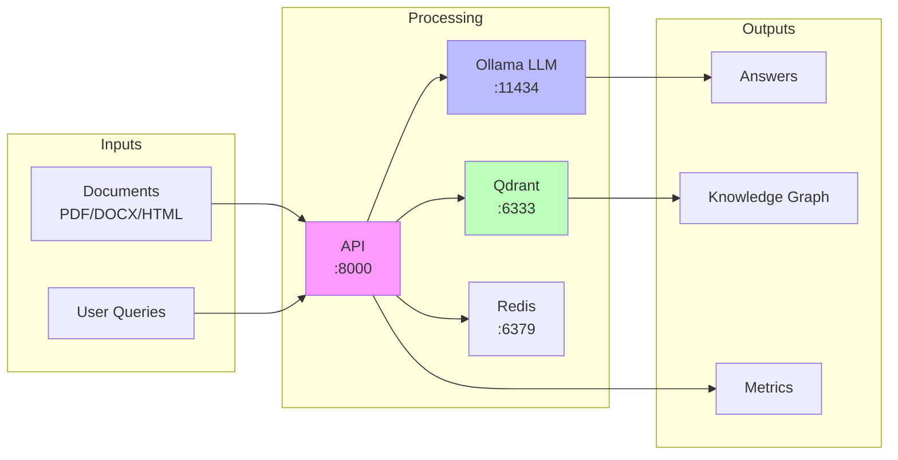

# Quick Reference Guide

## 🏗️ Pipeline Architecture



### Pipeline Flow
1. **Document Input** → API → Chunking → Embeddings → Vector DB
2. **Query Input** → API → Vector Search + LLM → Answer
3. **Monitoring** → Prometheus → Grafana Dashboards

### 📥 Supported Inputs

| Type | Formats | Endpoint | Example |
|------|---------|----------|---------|
| **Documents** | PDF, DOCX, PPTX, XLSX, HTML, MD, TXT | POST /documents | `{"documents": ["text..."]}` |
| **Queries** | Natural language text | POST /query | `{"question": "...", "mode": "hybrid"}` |
| **Query Modes** | naive, local, global, hybrid | - | Use in query endpoint |

### 📤 System Outputs

| Output | Description | Access |
|--------|-------------|---------|
| **Answers** | Context-aware responses | Query API response |
| **Knowledge Graph** | Entities & relationships | GET /graph |
| **Embeddings** | 768-dimensional vectors | Stored in Qdrant |
| **Metrics** | Performance stats | GET /metrics or Grafana |
| **Logs** | Structured JSON logs | docker logs rag_api |

## 🚀 Quick Start
```bash
# Clone and setup
git clone <repository>
cd llm_backend
cd LightRAG && pip install -e . && cd ..
cp .env.example .env

# Start all services
docker-compose up -d

# Check status
docker ps

# Run tests
python run_tests.py
```

## 🔗 Service URLs

| Service | URL | Purpose |
|---------|-----|---------|
| **API** | http://localhost:9000 | Main REST API |
| **API Docs** | http://localhost:9000/api/docs | Swagger UI |
| **Ollama** | http://localhost:12434 | LLM Service |
| **Qdrant** | http://localhost:7333 | Vector Database |
| **Qdrant UI** | http://localhost:7333/dashboard | Qdrant Dashboard |
| **Prometheus** | http://localhost:10090 | Metrics |
| **Grafana** | http://localhost:4000 | Dashboards (admin/admin) |
| **Redis** | redis://localhost:7379 | Cache/Queue |

## 📡 Common API Calls

### Health Checks
```bash
# API health
curl http://localhost:8000/health

# Detailed readiness
curl http://localhost:8000/health/ready

# Metrics
curl http://localhost:8000/metrics
```

### Document Operations
```bash
# Insert documents
curl -X POST http://localhost:8000/documents \
  -H "Content-Type: application/json" \
  -d '{"documents": ["Your document text here"]}'

# Query documents
curl -X POST http://localhost:8000/query \
  -H "Content-Type: application/json" \
  -d '{"question": "What is AI?", "mode": "hybrid"}'
```

### LLM Operations (Ollama)
```bash
# List models
curl http://localhost:11434/api/tags

# Generate text
curl -X POST http://localhost:11434/api/generate \
  -d '{"model": "qwen2.5:7b-instruct", "prompt": "Hello", "stream": false}'

# Generate embeddings
curl -X POST http://localhost:11434/api/embeddings \
  -d '{"model": "nomic-embed-text", "prompt": "Text to embed"}'
```

## 🐳 Docker Commands

### Service Management
```bash
# Start services
docker-compose up -d

# Stop services
docker-compose down

# Restart service
docker-compose restart rag_api

# View logs
docker-compose logs -f rag_api

# Enter container
docker exec -it rag_api /bin/bash
```

### Monitoring
```bash
# Service status
docker-compose ps

# Resource usage
docker stats

# Check logs
docker-compose logs --tail=50
```

## 🧪 Testing

### Run Tests
```bash
# All tests
python run_tests.py

# Specific tests
python run_tests.py --unit
python run_tests.py --integration
python run_tests.py --infrastructure

# With coverage
python run_tests.py --coverage
```

### Test Individual Services
```bash
# Test Ollama
curl http://localhost:11434/api/version

# Test Qdrant
curl http://localhost:6333/collections

# Test Redis
docker exec rag_redis redis-cli ping
```

## 🔍 Debugging

### Check Service Logs
```bash
# API logs
docker logs rag_api --tail=50

# All services
docker-compose logs

# Follow logs
docker-compose logs -f
```

### Common Issues
```bash
# Port in use
lsof -i :8000
kill -9 <PID>

# Service won't start
docker-compose logs <service_name>
docker-compose restart <service_name>

# Clean up
docker system prune -a
```

## 📊 Metrics & Monitoring

### Prometheus Queries
```
# Service uptime
up

# Request rate
rate(http_requests_total[5m])

# Response time (95th percentile)
histogram_quantile(0.95, rate(http_request_duration_seconds_bucket[5m]))

# Documents processed
documents_processed_total
```

### Grafana Access
1. Open http://localhost:4000
2. Login: admin / admin
3. Dashboard: "RAG System Metrics"

## 🛠️ Development

### Environment Variables
```bash
# Key settings in .env
RAG_API_KEY_ENABLED=false
RAG_LLM_MODEL=qwen2.5:7b-instruct
RAG_EMBEDDING_MODEL=nomic-embed-text
RAG_LOG_LEVEL=INFO
```

### Python Client Example
```python
import requests

# Insert document
response = requests.post(
    "http://localhost:8000/documents",
    json={"documents": ["AI is transforming technology"]}
)

# Query
response = requests.post(
    "http://localhost:8000/query",
    json={"question": "What is AI?", "mode": "hybrid"}
)
print(response.json()["answer"])
```

## 📚 Documentation

- **Setup**: [README.md](README.md)
- **Architecture**: [ARCHITECTURE.md](ARCHITECTURE.md)
- **Services**: [SERVICES.md](SERVICES.md)
- **Testing**: [TESTING.md](TESTING.md)
- **Deployment**: [DEPLOYMENT.md](DEPLOYMENT.md)

## 🆘 Help

```bash
# Test runner help
python run_tests.py --help

# Docker help
docker-compose --help

# Check service status
./run_tests.sh
```

---
*Keep this handy for quick development reference!*